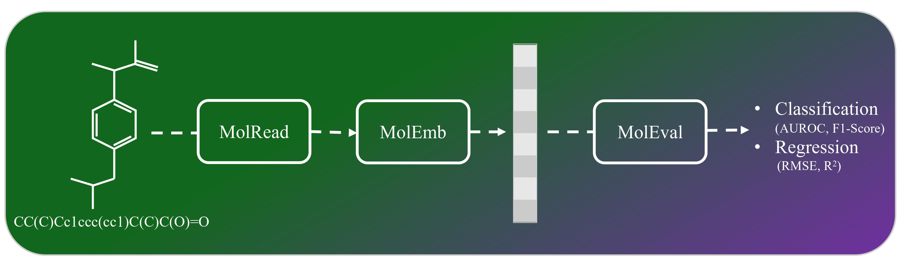

# `MolEval`: An Evaluation Toolkit for Molecular Embeddings via Large Language Models

<div align="center">
  
</div>

Drawing on the precedents set by `SentEval`—a toolkit designed to assess sentence embeddings— and `MoleculeNet`, a benchmark suite for molecular machine learning, we introduce MolEval. MolEval innovatively tackles the issue of evaluating large language models `(LLMs)` embeddings, which are traditionally expensive to execute on standard computing hardware. It achieves this by offering a repository of pre-computed `molecule embeddings`, alongside a versatile platform that facilitates the evaluation of any embeddings derived from molecular structures. This approach not only streamlines the assessment process but also makes it more accessible to researchers and practitioners in the field.
# 1. Quick Start [](https://colab.research.google.com/drive/1AuqkCh7KLN2LWHPaKQdr-trvwDUdRhZ4?usp=sharing)

## 1.1. Install MolEval
```python
!git clone https://github.com/sshaghayeghs/MolEval
!cd MolEval
!pip install torch transformers pandas numpy tqdm openai sentence-transformers peft angle-emb deepchem rdkit

```

## 1.2. MolRead
Available datasets from [MoleculeNet](https://moleculenet.org/datasets-1): `bbbp, bace_classifcation, hiv, tox21, clintox, sider, lipo, freesolv, delaney`
```python
from MolEval.MolRead import load_dataset
df=load_dataset('bace_classification')
```
## 1.3. MolEmb 
Available embedding model: `SBERT, LLaMA2, Molformer, ChemBERTa, BERT, RoBERTa_ZINC, RoBERTa, SimCSE, AngleBERT, GPT, Mol2Vec, Morgan`
```python
from MolEval import MolEmb 
model_name = 'Morgan'  # Replace with the model you want to use
openai_api_key = 'your_openai_api_key'  # Required if using GPT
huggingface_token = 'your_huggingface_token'  # Required if using LLaMA2

extractor = MolEmb.EmbeddingExtractor(model_name=model_name, df=df, openai_api_key=openai_api_key, huggingface_token=huggingface_token)
emb, df = extractor.get_embeddings()
print(emb)
```

## 1.4. MolEval
### 1.4.1. Classification
If dataset in `bbbp, bace_classification, hiv`, task is `Classification`

elif dataset in `tox21, clintox, sider`, task is `MultitaskClassification`
```python
from MolEval.MolEval import evaluate_classification
f1_score,f1_score_std,AUROC,AUROC_std=evaluate_classification(features=emb.to_numpy(), targets=df.drop(columns=['SMILES']).to_numpy(), n_splits=5, task='Classification')
print(f'F1 score: {f1_score:.4f} +/- {f1_score_std:.4f}')
print(f'AUROC: {AUROC:.4f} +/- {AUROC_std:.4f}')
```

### 1.4.2. Regression
If dataset in `lipo, freesolv, delaney`, use is evaluate_regression

```python
from MolEval import evaluate_regression
RMSE,RMSE_std,R2,R2_std=evaluate_regression(features=emb.to_numpy(), targets=df.drop(columns=['SMILES']).to_numpy(), n_splits=5)
print(f'RMSE: {RMSE:.4f} +/- {RMSE_std:.4f}')
print(f'R2: {R2:.4f} +/- {R2_std:.4f}')
```


# 2. Related Works

  * [MTEB: Massive Text Embedding Benchmark](https://aclanthology.org/2023.eacl-main.148.pdf)
  * [SentEval](https://aclanthology.org/L18-1269.pdf)
  * [DeepChem](https://deepchem.readthedocs.io/en/latest/)
  * [MolculeNet](https://pubs.rsc.org/en/content/articlelanding/2018/sc/c7sc02664a)


