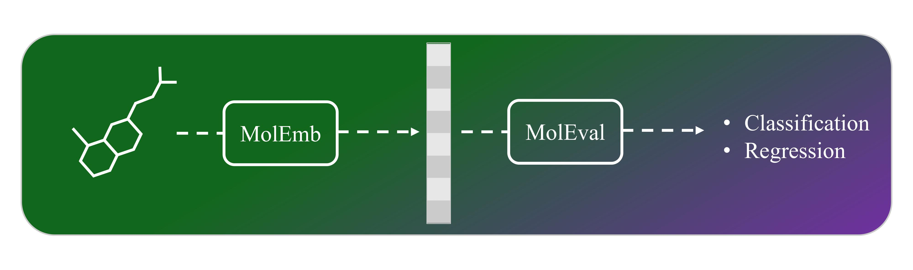

# `MolEval`: An Evaluation Toolkit for Molecular Embeddings via Large Language Models

<div align="center">
  
</div>

Drawing on the precedents set by `SentEval`—a toolkit designed to assess sentence embeddings— and `MoleculeNet`, a benchmark suite for molecular machine learning, we introduce MolEval. MolEval innovatively tackles the issue of evaluating large language models `(LLMs)` embeddings, which are traditionally expensive to execute on standard computing hardware. It achieves this by offering a repository of pre-computed `molecule embeddings`, alongside a versatile platform that facilitates the evaluation of any embeddings derived from molecular structures. This approach not only streamlines the assessment process but also makes it more accessible to researchers and practitioners in the field.
# Quick Start [](https://colab.research.google.com/drive/1Uk_rhjIFjr-uOu2j4QHntyPwGDaMrfRZ?usp=sharing)

## Install MolEval
```python
!git clone https://github.com/sshaghayeghs/MolEval
!cd MolEval
!pip install -r Requirments.txt
```

## Loading a Dataset
Available datasets: `bbbp, bace_classifcation, hiv, tox21, clintox, sider, lipo, freesolv, delaney`
```python
from MolData import load_dataset
df=load_dataset('bace_classification')
df['SMILES'] = df['SMILES'].astype(str)
```
## MolEmb 
Available embedding model: `llama2, molformer, chemberta, bert, roberta_zinc, gpt2, roberta, simcse, anglebert, sbert, mol2vec, morgan`
```python
import MolEmb
hf_token = 'your_huuging_face_access_token'  # Replace with your actual HF token
api_key = 'your_openai_api_key'  # Replace with your actual openai api key
extractor = MolEmb.EmbeddingExtractor(hf_token=hf_token, api_key=api_key)
smiles = df['SMILES'].to_list()
emb = extractor.extract_features(smiles, "gpt2")
print(emb)
```

## MolEval
### Classification
If dataset in `bbbp, bace_classification, hiv`, task is `Classification`

elif dataset in `delaney, sider, lipo`, task is `Multi-task Classification`
```python
from MolEval import evaluate_classification
f1_score,f1_score_std,AUROC,AUROC_std=evaluate_classification(features=emb.to_numpy(), targets=df.drop(columns=['SMILES']).to_numpy(), n_splits=5, task='Classification')
print(f'F1 score: {f1_score:.4f} +/- {f1_score_std:.4f}')
print(f'AUROC: {AUROC:.4f} +/- {AUROC_std:.4f}')
```

### Regression
If dataset in `lipo, freesolv, delaney`, use is evaluate_regression

```python
from Eval import evaluate_regression
RMSE,RMSE_std,R2,R2_std=evaluate_regression(features=emb.to_numpy(), targets=df.drop(columns=['SMILES']).to_numpy(), n_splits=5)
print(f'RMSE: {RMSE:.4f} +/- {RMSE_std:.4f}')
print(f'R2: {R2:.4f} +/- {R2_std:.4f}')
```
# How to cite
Please cite MolEval if you use it in your research: 

# License


